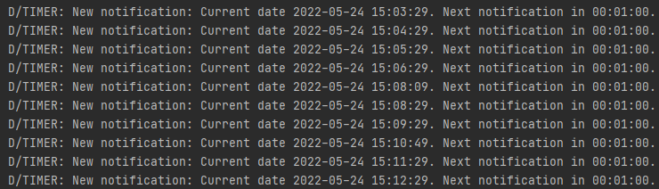
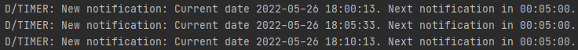

# Android Local Wi-Fi Radar App homework

Simple Java Android application **Timer** created in Android studio.

Application is using [AlarmManager](https://developer.android.com/training/scheduling/alarms) and [Broadcast receiver](https://developer.android.com/guide/components/broadcasts). Broadcast receiver is implemented in `Timer` class `(package com.example.timer)` where also [Notification](https://developer.android.com/guide/topics/ui/notifiers/notifications) body is created.

UI is very simple, clicking the main display time opens a Time picker which allows the user to combine all parameters given by the task and set arbitrary time interval (HH:MM:SS). It was inspired by [custom-datetimepicker](https://stackoverflow.com/questions/7847623/how-to-pick-a-second-using-timepicker-android).

And finally, there are two buttons to start and stop the Timer with selected interval. The functionality of UI elements is implemented in the `MainActivity`.

## Problem with inexact alarm repeating

Alarm delivery is inexact in order to minimize wakeups and battery use. This is only the problem when setting a shorter interval between notifications (for example few seconds which in my opinion is an useless use case so it is not a problem at all. For a longer interval it works almost exact as you can see in the debug prints below).

## Task

Implement timer Java Android application, which will send push-notification every X- interval. The
Application should allow user to set an interval and run in the background. The Interval can be set to X-
hours/minutes/seconds. Push-notification should meet the following format:

“Current date YYYY-MM-DD and time HH:MM:SS. Next notification in X hours/minutes/seconds.”

e.g., “Current date 2022-05-09 12:40:00. Next notification in 5 seconds.”

Code of the project might be published at public (or private with then given access to read) repository
on GitHub. The repository itself should contain README.md file with a clear project description, i.e., the
goals of the application and how it works.
